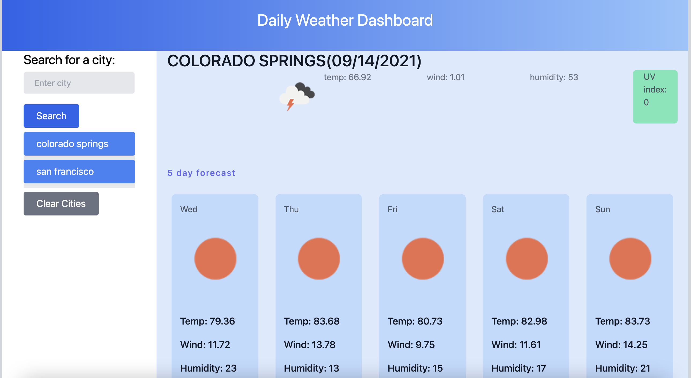

## Description
Basic application to schedule tasks throughout the day

## Frameworks used
* Tailwindcss
* day.js

## Features
* Displays weather for the current day 
* Displays weather based on the city entered
* Saves cities to local storage
* Displays five day forecast
* Highlights uv index in different colors depending on level

## Deployment
This can be cloned using git and then run retaining the directory structure with the web server of your choice.

## Deployed Example
<https://philipbrowning.github.io/dayplanner/>

<b>Desktop version</b>

### License
The code is available under the [MIT license](https://github.com/h5bp/html5-boilerplate/blob/master/LICENSE.txt).